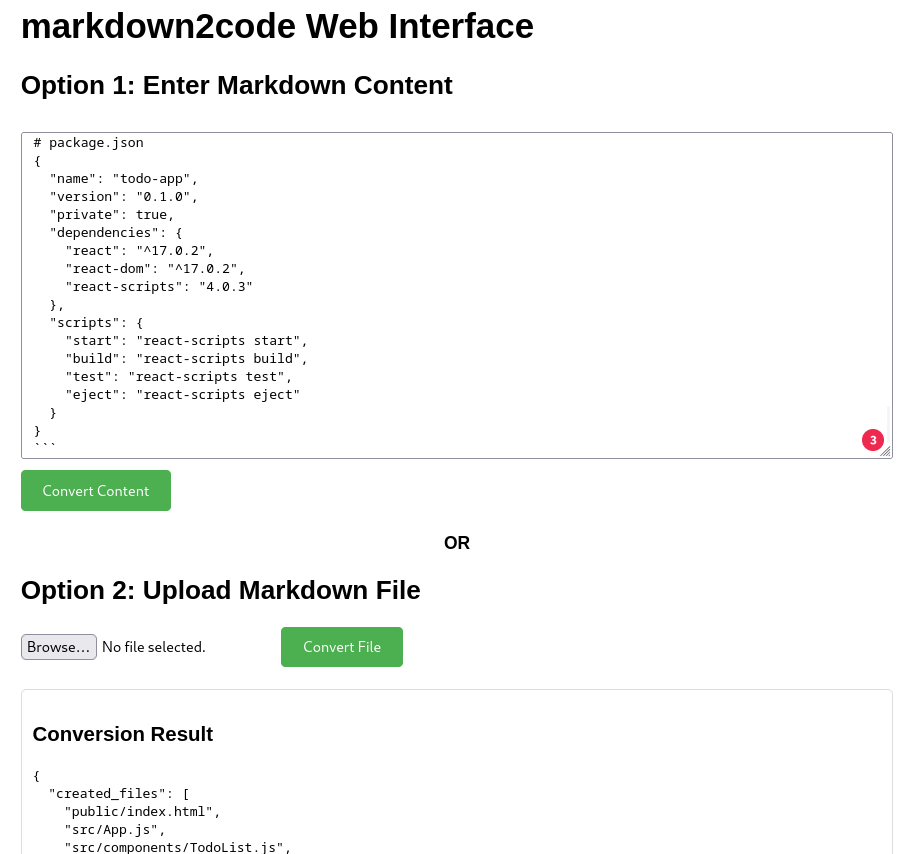

# markdown2code
```bash
                       _       _                     ___               _      
                      | |     | |                   |__ \             | |     
  _ __ ___   __ _ _ __| | ____| | _____      ___ __    ) |___ ___   __| | ___ 
 | '_ ` _ \ / _` | '__| |/ / _` |/ _ \ \ /\ / / '_ \  / // __/ _ \ / _` |/ _ \
 | | | | | | (_| | |  |   < (_| | (_) \ V  V /| | | |/ /| (_| (_) | (_| |  __/
 |_| |_| |_|\__,_|_|  |_|\_\__,_|\___/ \_/\_/ |_| |_|____\___\___/ \__,_|\___|
```    


Convert markdown files into organized project structures with code files. This tool helps extract and organize code from markdown files, particularly useful for AI chat conversations.

## Available Commands

### Basic Conversion
```bash
markdown2code convert input.md
```
Convert markdown file to code files in current directory.

### Preview Mode
```bash
markdown2code convert input.md --preview
```
Preview files that would be created without making changes.

### Output Directory
```bash
markdown2code convert input.md --output ./my-project
```
Specify where to create the files.

### Force Overwrite
```bash
markdown2code convert input.md --force
```
Overwrite existing files without confirmation.

### Web Interface

```bash
markdown2code server [--host HOST] [--port PORT] [--output DIR]
```
Start web interface for browser-based conversion.

### Backup Operations
```bash
# Create backup
markdown2code backup create [--files FILES] [--message MSG]

# List backups
markdown2code backup list

# Show backup details
markdown2code backup info BACKUP_NAME

# Restore backup
markdown2code backup restore BACKUP_NAME

# Delete backup
markdown2code backup delete BACKUP_NAME
```
Manage Git-based backups of your files.

### Quick Backup & Restore
```bash
# Create backup during conversion
markdown2code convert input.md --backup

# Restore last backup
markdown2code convert input.md --restore
```
Quick backup and restore operations.

### Configuration
```bash
# Create default config
markdown2code --create-config

# Use custom config
markdown2code convert input.md --config my-config.yml
```
Manage tool configuration.

### Verbose Output
```bash
markdown2code convert input.md --verbose
```
Show detailed operation information.

## Common Use Cases

1. **AI Chat Conversion**
   ```bash
   markdown2code convert chat.md --output my-project
   ```
   Convert AI chat conversation into a project.

2. **Safe Conversion with Backup**
   ```bash
   markdown2code convert input.md --backup --force
   ```
   Create backup and force overwrite files.

3. **Web-based Conversion**
   ```bash
   markdown2code server --output projects
   ```
   Start web interface for browser-based conversion.

4. **Project Preview**
   ```bash
   markdown2code convert input.md --preview --output new-project
   ```
   Preview project structure before creation.

5. **Backup Management**
   ```bash
   markdown2code backup create --message "Initial version"
   ```
   Create named backup of current state.
