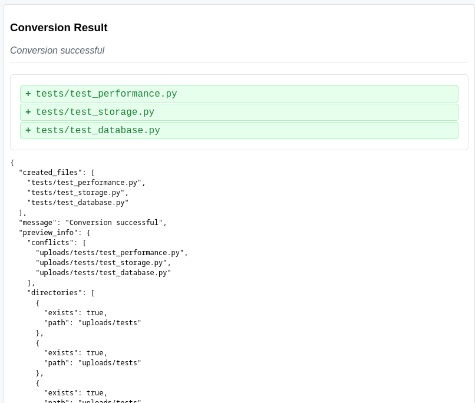

# markdown2code
```bash
                       _       _                     ___               _      
                      | |     | |                   |__ \             | |     
  _ __ ___   __ _ _ __| | ____| | _____      ___ __    ) |___ ___   __| | ___ 
 | '_ ` _ \ / _` | '__| |/ / _` |/ _ \ \ /\ / / '_ \  / // __/ _ \ / _` |/ _ \
 | | | | | | (_| | |  |   < (_| | (_) \ V  V /| | | |/ /| (_| (_) | (_| |  __/
 |_| |_| |_|\__,_|_|  |_|\_\__,_|\___/ \_/\_/ |_| |_|____\___\___/ \__,_|\___|
```    

Convert markdown files into organized project structures with code files. This tool is particularly useful for converting code snippets from AI chat conversations (like ChatGPT, Claude, etc.) into actual project files.

## Features

- Extracts code blocks from markdown files
- Automatically detects programming languages
- Creates directory structures based on markdown content
- Supports filename detection from comments
- Handles multiple programming languages
- Maintains file permissions (executable for shell scripts)
- Preview mode to check files before creation
- File conflict detection and handling
- Configuration system with YAML support
- Verbose logging options
- Web interface for browser-based conversion

## Installation

```bash
pip install markdown2code
```

## Quick Start

```bash
# Convert markdown to code
markdown2code convert input.md

# Preview files to be created
markdown2code convert input.md --preview

# Specify output directory
markdown2code convert input.md --output ./my-project

# Force overwrite existing files
markdown2code convert input.md --force

# Enable verbose logging
markdown2code convert input.md --verbose

# Use custom configuration
markdown2code convert input.md --config my-config.yml

# Create default configuration
markdown2code --create-config

# Start web interface
markdown2code server --port 5000
```

## Configuration

### Default Configuration

Create a default configuration file:
```bash
markdown2code --create-config
```

This creates `.markdown2code.yml` with default settings:
```yaml
file_patterns:
  javascript: ['script.js', 'index.js', 'main.js']
  python: ['script.py', 'main.py', 'app.py']
  # ... more patterns

logging:
  level: INFO
  format: '%(asctime)s - %(name)s - %(levelname)s - %(message)s'

output:
  colored: false
  verbose: false
```

### Custom Configuration

Create a custom configuration file:
```yaml
# .markdown2code.yml
file_patterns:
  python:
    - main.py
    - app.py
    - script.py
  javascript:
    - index.js
    - app.js
    - client.js

logging:
  level: DEBUG
  format: '%(levelname)s: %(message)s'

output:
  colored: true
  verbose: true
```

### File Patterns

Default file patterns for common languages:
- JavaScript: script.js, index.js, main.js
- Python: script.py, main.py, app.py
- HTML: index.html, main.html, app.html
- CSS: styles.css, main.css, app.css
- And many more...

## Command Line Options

### Convert Command
```bash
markdown2code convert [options] input.md

Options:
  --output, -o DIR    Output directory (default: current)
  --preview, -p       Preview files without creating
  --force, -f        Force overwrite existing files
  --backup, -b       Create Git backup before conversion
  --restore, -r      Restore from last backup
  --verbose, -v      Enable verbose output
  --config, -c FILE  Use custom configuration file
  --create-config    Create default configuration file
  --version         Show version number
  --help            Show this help message
```

### Server Command
```bash
markdown2code server [options]

Options:
  --host HOST       Host to bind to (default: localhost)
  --port PORT       Port to listen on (default: 5000)
  --output DIR      Output directory for converted files (default: uploads)
```

## Web Interface

markdown2code provides a web-based interface for converting markdown to code files through your browser.

### Starting the Web Server

```bash
# Start with default settings (localhost:5000)
markdown2code server

# Use custom host and port
markdown2code server --host 0.0.0.0 --port 8000

# Specify output directory
markdown2code server --output ./my-projects
```

### Using the Web Interface

1. Start the server using one of the commands above
2. Open your browser and navigate to the server URL (e.g., http://localhost:5000)
3. Choose one of two options:
   - Enter markdown content directly in the text area
   - Upload a markdown file
4. Click "Convert" to process your markdown
5. View the conversion results, including:
   - List of created files
   - Directory structure
   - Any conversion messages or errors

### Features

- Direct markdown content input
- File upload support
- Automatic project.md creation
- Real-time conversion feedback
- Error handling and display
- Clean, responsive UI
- Configurable output directory

### Example Usage

1. Start the server with a custom output directory:
```bash
markdown2code server --output ./projects
```

2. Open http://localhost:5000 in your browser

3. Enter or upload your markdown content

4. After conversion, your files will be created in the specified output directory:
```
projects/
├── project.md          # Your original markdown
├── src/               # Generated source files
│   ├── main.py
│   └── utils.py
└── ...                # Other generated files
```

## Backup and Restore


### Backup and Restore

#### Creating Backups
The --backup flag creates a Git backup before making any changes:

```bash
# Preview with backup information
markdown2code convert input.md --preview --backup

# Convert with automatic backup
markdown2code convert input.md --backup

# Force overwrite with backup
markdown2code convert input.md --force --backup
```

Example output with --backup:
```
Creating backup before proceeding...
Created backup in branch: backup_20240109_123456

Backed up files:
- src/main.py
- tests/test_main.py

Files to be created:
Directory: ./src (will be created)
File: ./src/main.py (exists)
File: ./src/utils.py (will be created)

Note: Original state backed up in branch: backup_20240109_123456
Project structure created successfully!
```

#### Quick Restore
Use the --restore flag to quickly restore from the most recent backup:

```bash
# Restore from last backup
markdown2code convert input.md --restore
```

Example restore output:
```
Restored 3 files from last backup: backup_20240109_123456

Restored files:
- src/main.py
- src/utils.py
- tests/test_main.py
```

#### Manual Backup Management
For more control over backups:

```bash
# List all backups (newest first)
markdown2code backup list

# Show backup details
markdown2code backup info backup_20240109_123456

# Restore specific backup
markdown2code backup restore backup_20240109_123456

# Delete old backup
markdown2code backup delete backup_20240109_123456
```

## Troubleshooting


### Backup and Restore Issues

1. Quick Restore Fails
```bash
# Check available backups
markdown2code backup list

# Try manual restore if needed
markdown2code backup restore BACKUP_NAME
```

2. No Backups Found
```bash
# Check if directory is a git repository
git status

# Initialize if needed
git init

# Create initial backup
markdown2code convert input.md --backup
```

3. Restore Conflicts
```bash
# Preview changes first
markdown2code convert input.md --preview --restore

# Force restore if needed
markdown2code convert input.md --force --restore
```


### Best Practices

1. Create descriptive backup messages:
```bash
markdown2code backup create --message "Added new API endpoints"
```

2. Backup before major changes:
```bash
markdown2code backup create --message "Pre-refactor backup"
```

3. Regular backups of specific files:
```bash
markdown2code backup create --files src/* --message "Source code backup"
```

4. Check backup status:
```bash
markdown2code backup list
markdown2code backup info BACKUP_NAME
```


### Backup Issues

1. Restore Fails
```bash
# Check if working directory is clean
git status

# Force clean working directory
git reset --hard
git clean -fd

# Try restore again
markdown2code backup restore BACKUP_NAME
```

2. Backup Creation Fails
```bash
# Check if git is initialized
git status

# Initialize if needed
git init

# Try backup again
markdown2code backup create
```

3. Backup Conflicts
```bash
# List all backups
markdown2code backup list

# Check specific backup
markdown2code backup info BACKUP_NAME

# Delete problematic backup if needed
markdown2code backup delete BACKUP_NAME
```

2. Run tests:
```bash
pytest
pytest --cov=markdown2code
```

See [CONTRIBUTING.md](CONTRIBUTING.md) for detailed development guidelines.

## Troubleshooting

### Common Issues

1. File Conflicts
```bash
# Use preview to check conflicts
markdown2code input.md --preview

# Force overwrite if needed
markdown2code input.md --force
```

2. Configuration Issues
```bash
# Create fresh configuration
markdown2code --create-config

# Use verbose logging
markdown2code input.md --verbose
```

3. Permission Issues
```bash
# Check file permissions
ls -l output_dir

# Fix shell script permissions
chmod +x output_dir/*.sh
```

## License

This project is licensed under the Apache License - see the [LICENSE](LICENSE) file for details.


## AI Chat Example

Here's an example of converting an AI chat into a working project:

1. Save this AI chat conversation as `chat.md`:

````markdown
# React Todo App Development Chat
Project structure suggested by AI:
```markdown
todo-app/
├── public/
│   └── index.html
├── src/
│   ├── components/
│   │   ├── TodoList.js
│   │   └── TodoItem.js
│   ├── App.js
│   └── index.js
└── package.json
```

The AI suggested this HTML:
```html
# public/index.html
<!DOCTYPE html>
<html lang="en">
<head>
    <meta charset="UTF-8">
    <meta name="viewport" content="width=device-width, initial-scale=1.0">
    <title>Todo App</title>
</head>
<body>
    <div id="root"></div>
</body>
</html>
```
...
````
[chat.md](chat.md)

2. Convert the chat to a project:

3. Preview what will be created
```bash
markdown2code chat.md --preview --output todo-app
```
Output:
```bash
Preview of files to be created:

Directories:
- todo-app/todo-app (will be created)
- todo-app/public (will be created)
- todo-app/src (will be created)
- todo-app/components (will be created)

Files:
- todo-app/README.md (will be created)
- todo-app/public/index.html (will be created)
- todo-app/src/App.js (will be created)
- todo-app/src/components/TodoList.js (will be created)
- todo-app/src/components/TodoItem.js (will be created)
- todo-app/src/index.js (will be created)
- todo-app/package.json (will be created)
```

# Create the project
```bash
markdown2code chat.md --output todo-app
```
```
2024-11-20 16:10:55,512 - markdown2code.converter - INFO - 
Files to be created:
2024-11-20 16:10:55,513 - markdown2code.converter - INFO - Directory: todo-app/todo-app (will be created)
2024-11-20 16:10:55,513 - markdown2code.converter - INFO - Directory: todo-app/public (will be created)
2024-11-20 16:10:55,513 - markdown2code.converter - INFO - Directory: todo-app/src (will be created)
2024-11-20 16:10:55,513 - markdown2code.converter - INFO - Directory: todo-app/components (will be created)
2024-11-20 16:10:55,513 - markdown2code.converter - INFO - File: todo-app/README.md (will be created)
2024-11-20 16:10:55,513 - markdown2code.converter - INFO - File: todo-app/public/index.html (will be created)
2024-11-20 16:10:55,513 - markdown2code.converter - INFO - File: todo-app/src/App.js (will be created)
2024-11-20 16:10:55,513 - markdown2code.converter - INFO - File: todo-app/src/components/TodoList.js (will be created)
2024-11-20 16:10:55,513 - markdown2code.converter - INFO - File: todo-app/src/components/TodoItem.js (will be created)
2024-11-20 16:10:55,513 - markdown2code.converter - INFO - File: todo-app/src/index.js (will be created)
2024-11-20 16:10:55,513 - markdown2code.converter - INFO - File: todo-app/package.json (will be created)
2024-11-20 16:10:55,514 - markdown2code.converter - INFO - Creating file: todo-app/README.md
2024-11-20 16:10:55,514 - markdown2code.converter - INFO - Creating file: todo-app/public/index.html
2024-11-20 16:10:55,515 - markdown2code.converter - INFO - Creating file: todo-app/src/App.js
2024-11-20 16:10:55,515 - markdown2code.converter - INFO - Creating file: todo-app/src/components/TodoList.js
2024-11-20 16:10:55,515 - markdown2code.converter - INFO - Creating file: todo-app/src/components/TodoItem.js
2024-11-20 16:10:55,516 - markdown2code.converter - INFO - Creating file: todo-app/src/index.js
2024-11-20 16:10:55,516 - markdown2code.converter - INFO - Creating file: todo-app/package.json
2024-11-20 16:10:55,516 - markdown2code.converter - INFO - 
Created files:
2024-11-20 16:10:55,516 - markdown2code.converter - INFO - - README.md
2024-11-20 16:10:55,516 - markdown2code.converter - INFO - - package.json
2024-11-20 16:10:55,516 - markdown2code.converter - INFO - - public/index.html
2024-11-20 16:10:55,516 - markdown2code.converter - INFO - - src/App.js
2024-11-20 16:10:55,516 - markdown2code.converter - INFO - - src/components/TodoItem.js
2024-11-20 16:10:55,516 - markdown2code.converter - INFO - - src/components/TodoList.js
2024-11-20 16:10:55,516 - markdown2code.converter - INFO - - src/index.js
2024-11-20 16:10:55,516 - markdown2code.converter - INFO - 
Project structure created successfully!
```


3. Run the project:
```bash
cd todo-app
npm install
npm start
```
```bash
pip install -e . && python -m markdown2code server --host localhost --port 5000
python -m markdown2code server --host localhost --port 5000
markdown2code server --host localhost --port 5001 --output test_output
markdown2code server --host localhost --port 5000
```


## TESTS

```bash
python -m markdown2code convert test_python_files.txt --output test_output
```

Output

```bash
2024-11-20 20:28:04,455 - markdown2code.converter - INFO - Creating file: test_output/tests/conftest.py
2024-11-20 20:28:04,455 - markdown2code.converter - INFO - Creating file: test_output/tests/test_api.py
2024-11-20 20:28:04,455 - markdown2code.converter - INFO - 
Created files:
2024-11-20 20:28:04,455 - markdown2code.converter - INFO - - tests/conftest.py
2024-11-20 20:28:04,455 - markdown2code.converter - INFO - - tests/test_api.py
2024-11-20 20:28:04,455 - markdown2code.converter - INFO - 
Project structure created successfully!
```

## How it works


markdown2code solution that includes both a Firefox extension and a web interface for converting markdown content to code files.
after starting server (and firefox plugin), we see 
```bash
markdown2code server
```


### Firefox Extension 
- A temporary extension called "Code Block Extractor"
- Has a unique Extension ID and Internal UUID




### Web Interface 
- Shows a markdown2code web interface where users can enter markdown content
- Has a conversion system that processes the input and creates multiple test files
- Successfully creates test files including:
  - tests/test_performance.py
  - tests/test_storage.py
  - tests/test_database.py


### Testing Framework 
The system includes comprehensive tests in Polish language covering:
- Performance tests (Testy wydajnościowe)
  - Handling concurrent requests
  - Processing large code blocks
  - Algorithm performance testing
- Storage tests (Testy przechowywania)
  - File organization in directories
  - Naming conventions
  - File management
- Database tests (Testy bazy danych)
  - Schema verification
  - Constraint testing
  - Data integrity verification


### Code Structure 
Shows the directory structure for storing code blocks:
```
code_blocks/
├── discord/
│   ├── python/
│   ├── javascript/
│   └── ...
├── github/
│   ├── python/
│   └── ...
└── ...
```

Each code block is stored in the appropriate directory with a unique filename containing a timestamp and hash.

The system appears to be capable of:
- Converting markdown to various code file formats
- Organizing code blocks by platform (Discord, GitHub) and language
- Maintaining test coverage across multiple aspects of the system
- Providing both a browser extension and web interface for user interaction
- Handling file conflicts and directory management
- Supporting multiple programming languages (at least Python and JavaScript)

The interface also shows some debugging output indicating successful conversions and file creation operations.


### Server Logs 
- Timestamp: 2024-11-21 00:42:13.002
- The markdown2code.converter.core created three test files:
  - tests/test_database.py
  - tests/test_performance.py
  - tests/test_storage.py
- A successful HTTP POST request to "/convert" endpoint (HTTP/1.1 200 response)
- The project structure was created successfully
- Server running on 127.0.0.1 (localhost)


### Generated Files Structure 
In the "uploads" directory:
- A "tests" folder containing:
  - test_database.py
  - test_performance.py
  - test_storage.py
  - project.md

This shows that the markdown2code server successfully processed the input and generated the corresponding Python test files
based on the markdown content that was copied and pasted into the system. 
